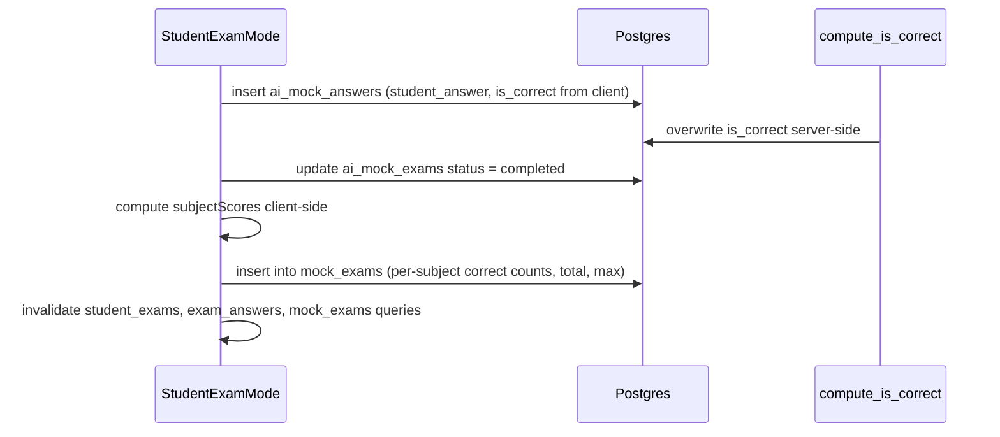

# AI Mock Exams

AI mock exams are AI-generated multiple-choice exams that a parent schedules and
<!-- openwiki: broken internal link [../mock-exam-tracker.md] file "../mock-exam-tracker.md" does not exist. Fix the href or restore the target, then delete this comment. -->
a student takes within a time window. Unlike [manual mock results](../mock-exam-tracker.md),
these have full question-level data (text, options, correct answer, student
answer, per-subject breakdown) and a lifecycle. The two subsystems meet when a
completed AI exam writes a summary row into the `mock_exams` table.

## Data model

Three tables (migration `20260403195718`), all RLS-enabled and scoped through
`ai_mock_exams`:

### `ai_mock_exams` — the exam envelope

| Column | Type | Notes |
|---|---|---|
| `id` | uuid | PK |
| `created_by` | uuid | the parent |
| `student_user_id` | uuid | the student |
| `title` | text | |
| `subjects` | text[] | subset of english/maths/vr/nvr |
| `topics` | text | optional focus |
| `num_questions` | int | default 10 |
| `scheduled_start` / `scheduled_end` | timestamptz | the active window |
| `status` | text | `scheduled` → `in_progress` → `completed` (`expired` is read-only) |

RLS: parents manage exams where `created_by = auth.uid()`; students read exams
where `student_user_id = auth.uid()` and may update the status of their assigned
exams.

### `ai_mock_questions` — generated questions

| Column | Type | Notes |
|---|---|---|
| `exam_id` | uuid | FK → `ai_mock_exams` (cascade delete) |
| `question_number` | int | 1-based |
| `question_text` | text | |
| `options` | jsonb | 4 options |
| `correct_answer` | text | must match an option |
| `subject` | text | normalized to english/maths/vr/nvr |
| `topic` | text | |

RLS: read access scoped transitively via the parent exam (`EXISTS` subquery on
`ai_mock_exams`). Parents can delete questions for exams they own.

### `ai_mock_answers` — student responses

| Column | Type | Notes |
|---|---|---|
| `exam_id` | uuid | FK → `ai_mock_exams` (cascade) |
| `question_id` | uuid | FK → `ai_mock_questions` (cascade) |
| `student_answer` | text | chosen option |
| `is_correct` | boolean | **computed by trigger, not trusted from client** |

The `compute_is_correct` `BEFORE INSERT` trigger overwrites `is_correct`
<!-- openwiki: broken internal link [../architecture/data-model.md] file "../architecture/data-model.md" does not exist. Fix the href or restore the target, then delete this comment. -->
server-side (see [data model](../architecture/data-model.md)) — the student
client sends an `is_correct` value in its payload, but it is ignored. RLS allows
students to insert answers only for their assigned exams and read their own
answers; parents can read answers for exams they created and delete them.

## Exam lifecycle

```mermaid
stateDiagram-v2
    [*] --> scheduled: parent creates exam (generate-mock-exam)
    scheduled --> in_progress: student opens active window (StudentExamMode)
    in_progress --> completed: student submits answers
    completed --> [*]
    note right of expired: read-only status, no writer exists
```

The **realized** transitions are only `scheduled → in_progress → completed`,
driven entirely by `StudentExamMode`:

1. `generate-mock-exam` inserts the exam with `status: "scheduled"`.
2. When `StudentExamMode` detects an active exam (`scheduled_start <= now <
   scheduled_end`) whose status is `scheduled`, it updates it to `in_progress`.
3. On submit, it inserts `ai_mock_answers` and updates the exam to `completed`.

The `expired` status is **read-only and aspirational**: `StudentAIMentorChat`
filters exams to `status === "expired"` to render "Missed" dates on the history
calendar, and `ExamHistoryCard` shows a "Missed" badge for it — but **no
migration, trigger, cron job, or client code ever writes `expired`**. There is no
scheduled job (no pg_cron config in `supabase/config.toml`), so missed exams are
never auto-marked; an exam whose window passes without being taken simply stays
in its last status. Code that reads `expired` is defending against a state that
no current code produces.

## Edge function: `supabase/functions/generate-mock-exam/index.ts`

A Deno `serve()` handler that creates an exam and generates its questions. It is
invoked directly by `ParentMockCreator` via `fetch` to the edge function URL.

### ⚠️ No caller authentication

<!-- openwiki: broken internal link [../ai-mentor.md] file "../ai-mentor.md" does not exist. Fix the href or restore the target, then delete this comment. -->
Unlike the [ai-mentor](../ai-mentor.md) function, `generate-mock-exam` performs
**no caller authentication** — it does not check an `Authorization` header and
does not call `getUser()`. It destructures `parent_user_id` and
`student_user_id` **directly from the request body** and writes via a
service-role client (`SUPABASE_SERVICE_ROLE_KEY`), bypassing RLS. The `created_by`
column is set to the body's `parent_user_id`. This is a trust boundary worth
noting: the function relies entirely on the body being honest about who the
parent and student are, and on network-level protection of the edge function
endpoint.

### Exam creation

After validating required fields (`title`, `subjects`, `student_user_id`,
`scheduled_start`, `scheduled_end`, `parent_user_id`), it inserts an
`ai_mock_exams` row with `status: "scheduled"` and `.select("id").single()` to
get the new exam id.

### Question generation via tool-calling

It POSTs to the Lovable AI gateway with a `tools` array defining a
`save_questions` function whose parameters are a strictly-typed array of
questions (exactly 4 options, one correct answer, subject enum
`english|maths|vr|nvr`, topic). `tool_choice` forces the model to call this
function. This structured-output approach avoids parsing free-form JSON, though a
fallback parses JSON from `message.content` if no tool call is returned.

### Sanitization

Before insertion, each question is run through `sanitizeQuestion`:

- `normalizeSubject(raw)` lowercases and maps variants (e.g. "mathematics" →
  "maths", "verbal reasoning" → "vr") onto the four canonical subjects,
  defaulting to "english".
- `stripJunk(s)` strips non-ASCII and trailing `,topic::...` artifacts.
- `correct_answer` and each option are trimmed, and if the correct answer
  doesn't exactly match an option, a fuzzy match attempts to align it.

Sanitized questions are inserted into `ai_mock_questions` with 1-based
`question_number`. The function returns `{ exam_id, questions_count }`.

## `ParentMockCreator`

`src/components/ParentMockCreator.tsx` (parent AI Mentor → Create Mock sub-tab)
is the form that calls the edge function. It collects title, subject checkboxes
(English/Maths/VR/NVR), optional topics, question count (select), date, start/end
times, and posts to the function with the resolved `student_user_id` (via the
<!-- openwiki: broken internal link [../auth-and-roles.md#single-student-lookup-assumption] file "../auth-and-roles.md" does not exist. Fix the href or restore the target, then delete this comment. -->
[single-student lookup](../auth-and-roles.md#single-student-lookup-assumption))
and `parent_user_id` (the current parent). On success it invalidates
`["ai_mock_exams"]` and toasts. It also lists created exams with status badges and
supports deletion (cascading: `ai_mock_answers` → `ai_mock_questions` →
`ai_mock_exams`).

## `StudentExamMode`

`src/components/StudentExamMode.tsx` is rendered in two contexts: directly as the
"Mocks" tab body for students (via `Index.tsx`) and as a banner at the top of the
<!-- openwiki: broken internal link [../ai-mentor.md] file "../ai-mentor.md" does not exist. Fix the href or restore the target, then delete this comment. -->
[AI mentor](../ai-mentor.md) view (`StudentAIMentorChat` renders `<StudentExamMode
/>` above the chat). It has three render modes:

1. **Active exam**: fetches questions for the active exam, auto-promotes
   `scheduled → in_progress`, renders each question with radio options, tracks
   `answers` keyed by question id, and disables submit until all answered.
2. **Results**: after submit (or if the exam is already `completed`), renders
   `MockExamResults`.
3. **Upcoming only**: if no active exam, lists upcoming scheduled exams.

### Submit flow and the `mock_exams` bridge

`handleSubmit` is the critical write path:



The `is_correct` value the client computes and sends is **ignored** — the
`compute_is_correct` trigger recomputes it from `ai_mock_questions.correct_answer`.
After marking the exam complete, the component writes a summary row into the
<!-- openwiki: broken internal link [../mock-exam-tracker.md] file "../mock-exam-tracker.md" does not exist. Fix the href or restore the target, then delete this comment. -->
`mock_exams` table (shared with [manual mock tracking](../mock-exam-tracker.md)):
`provider` = exam title, `english_score`/`maths_score`/`vr_score`/`nvr_score` =
per-subject correct counts, `total_score` = total correct, `max_score` = number
of questions, and a `notes` string. This is why completed AI exams appear in the
manual mock tracker.

## `MockExamResults`

`src/components/MockExamResults.tsx` is a presentational results view reused by
both `StudentExamMode` (post-submit) and `StudentAIMentorChat` (history review).
It computes an overall percentage and per-subject breakdown client-side
(`answers[q.id] === q.correct_answer`), color-codes ≥85% as success, and — when
`canReview` is true — renders a question-by-question answer review showing the
student's answer and the correct answer for missed questions.

## `ExamHistoryCard`

`src/components/ExamHistoryCard.tsx` is a compact card for one AI exam in the
history list. It is used **only** in `StudentAIMentorChat` (not in
`MockExamTracker`, which renders manual mocks inline). It shows the exam title,
date, a "Completed"/"Missed" badge (based on `status === "completed"` vs
`expired`), the total score with percentage, per-subject score chips, and a
"Review Results" button that triggers `MockExamResults` via `onReview`.

## `ParentExamResults`

`src/components/ParentExamResults.tsx` (parent AI Mentor → Exam Results sub-tab)
shows the parent a calendar-filtered view of their **completed** AI exams. It
fetches `ai_mock_exams` where `created_by = user.id` and `status = "completed"`,
then batches a single query for all questions and answers across those exams and
aggregates per-exam and per-subject correct/total counts. A calendar popover
filters by date.

## Query keys

The AI-exam components share several React Query keys, which is why invalidating
one (e.g. after submit) refreshes others:

- `["ai_mock_exams"]` / `["student_exams"]` — exam lists
- `["exam_questions", examId]` / `["exam_answers", examId]` — per-exam detail
- `["student_active_exam"]` — the active-window exam (polled every 30s)
- `["pending_exam_count"]` / `["today_completed_exams"]` — badge counters in
  `Index.tsx` (polled every 30s, student-only). These drive tab badges:
  `pendingExamCount` (a scheduled exam whose end is still in the future) lights
  a pulsing ⭐ Star on the **AI Mentor** tab trigger; `todayCompletedCount` (a
  `completed` exam started today) renders a pulsing count badge on the **Mocks**
  tab trigger. Both are `enabled` only when `isStudent`.
