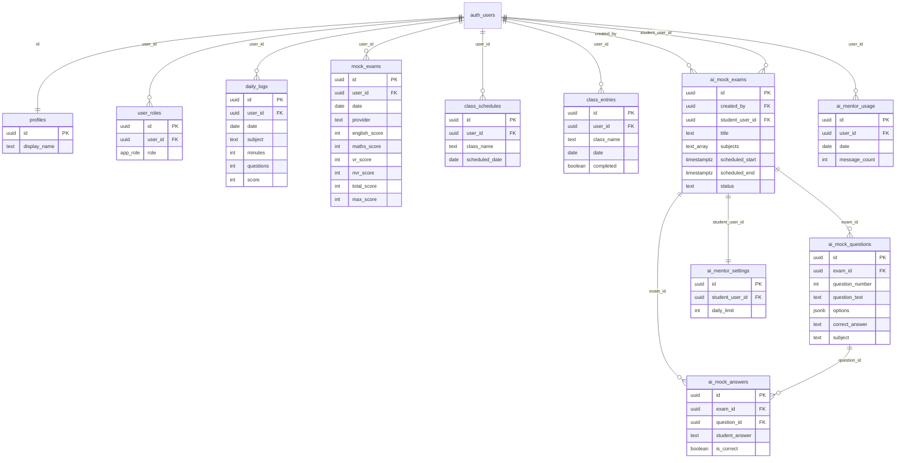

# Database Schema and Row-Level Security

StudyQuest's data layer is Supabase Postgres with **row-level security (RLS)**
on every table. The TypeScript-facing types are generated into
`src/integrations/supabase/types.ts`, and the typed client lives in
`src/integrations/supabase/client.ts`. The schema is defined across 15 migration
files in `supabase/migrations/`, which both create the tables and evolve the RLS
policies over time.

## Tables overview

| Table | Purpose | Key columns |
|---|---|---|
| `profiles` | Display name per user | `id` (= `auth.users.id`), `display_name` |
| `user_roles` | Role assignment | `user_id`, `role` (`parent` \| `student`) |
| `daily_logs` | Daily practice entries | `user_id`, `date`, `subject`, `minutes`, `questions`, `score` |
| `mock_exams` | Manual mock-exam results | `user_id`, `date`, `provider`, per-subject scores, `total_score`, `max_score` |
| `class_schedules` | Parent-scheduled class dates | `user_id`, `class_name`, `scheduled_date` |
| `class_entries` | Logged class details per date | `class_name`, `date`, `topics_covered`, `homework`, `notes`, `completed` |
| `ai_mock_exams` | AI-generated exam envelope | `created_by`, `student_user_id`, `title`, `subjects[]`, `scheduled_start/end`, `status` |
| `ai_mock_questions` | Questions for an AI exam | `exam_id`, `question_number`, `question_text`, `options` (jsonb), `correct_answer`, `subject` |
| `ai_mock_answers` | Student answers | `exam_id`, `question_id`, `student_answer`, `is_correct` |
| `ai_mentor_usage` | Per-student daily chat counter | `user_id`, `date`, `message_count` |
| `ai_mentor_settings` | Parent-set daily chat limit | `student_user_id`, `daily_limit` (default 20) |

The generated `Database` type in `types.ts` exposes each table's `Row`/`Insert`/
`Update` shapes, the `app_role` enum (`"parent" | "student"`), two RPC functions
(`has_role`, `increment_mentor_usage`), and the foreign-key relationships among
the AI exam tables (`ai_mock_questions.exam_id → ai_mock_exams.id`,
`ai_mock_answers.question_id → ai_mock_questions.id`).

## Entity-relationship diagram

The diagram above shows the core entities and their relationships; `auth.users`
is the Supabase Auth table referenced by every `user_id`/`id` column.

## Row-level security model

RLS is enabled on **all** application tables. The policies form a layered
ownership model with a parent-overseer pattern. The central primitive is the
`has_role(_user_id, _role)` `SECURITY DEFINER` SQL function, which checks
`user_roles` for a given user+role and is used inside nearly every policy.

### Ownership tiers

- **Self-ownership**: A user reads/updates/deletes their own rows where the row
  carries their `user_id` (or `id = auth.uid()` for `profiles`). This applies to
  `daily_logs`, `mock_exams`, `class_schedules`, `class_entries`,
  `ai_mentor_usage`.
- **Parent overseer**: A `parent` (via `has_role(auth.uid(), 'parent')`) can read
  **all** rows of student-shared tables: `daily_logs`, `mock_exams`,
  `class_schedules`, `class_entries`, `user_roles`, `ai_mentor_usage`, and
  parent-created `ai_mock_exams` (`created_by = auth.uid()`).
- **Student read-across**: Students can read **all** `class_schedules`,
  `class_entries`, and `mock_exams` (added by later migrations to support the
  single-shared-household model — see [auth and roles](../auth-and-roles.md)).
- **AI exam scoping**: `ai_mock_exams` parents manage exams they created;
  students read/update status of exams assigned to them
  (`student_user_id = auth.uid()`). `ai_mock_questions` and `ai_mock_answers` are
  scoped transitively through `ai_mock_exams` via `EXISTS` subqueries.

### Service role

The edge functions use `SUPABASE_SERVICE_ROLE_KEY` to **bypass RLS** for:
inserting `ai_mock_exams`/`ai_mock_questions` (in `generate-mock-exam`), and
reading/updating `ai_mentor_settings`/`ai_mentor_usage` (in `ai-mentor`). The
`handle_new_user` signup trigger is `SECURITY DEFINER` so it can insert into
`profiles` and `user_roles` before the user's own RLS session is established.

## Server-side triggers and RPCs

### `handle_new_user()` — auto-profile on signup

A `AFTER INSERT ON auth.users` trigger (migration
`20260403171516_..._f46a7d42.sql`) calls `handle_new_user()`, a `SECURITY
DEFINER` plpgsql function that inserts a `profiles` row (display name from
`raw_user_meta_data->>'display_name'`) and a `user_roles` row (role from
`raw_user_meta_data->>'role'`, defaulting to `student`). This is why the
`Auth.tsx` signup form passes `data: { display_name, role }` into
`supabase.auth.signUp`.

### `compute_is_correct()` — server-side grading invariant

Migration `20260404145821_..._22dffedd.sql` defines a `BEFORE INSERT` trigger on
`ai_mock_answers` that computes `is_correct` server-side by comparing
`NEW.student_answer` against the `ai_mock_questions.correct_answer` for the
referenced `question_id`. **This is a security invariant:** the student client
sends an `is_correct` value in its insert payload (`StudentExamMode.handleSubmit`),
but the trigger **overwrites** it with the server-computed result, so a student
cannot self-grade answers as correct. If the question is not found, `is_correct`
defaults to `false`.

### `increment_mentor_usage()` — defined but unused

Migration `20260404145821` also defines the `increment_mentor_usage()` RPC
(`SECURITY DEFINER`, upserts `ai_mentor_usage.message_count + 1` for the current
user/date). **This RPC is dead code** — it is registered in the generated
`types.ts` but never invoked by any client or edge function. The `ai-mentor`
edge function instead performs a manual `select`-then-`update`/`insert` upsert
of `ai_mentor_usage` after a successful AI response. See
[AI mentor](../ai-mentor.md).

### `has_role()` — RLS policy primitive

A `STABLE`, `SECURITY DEFINER` SQL function returning whether a given
`(_user_id, _role)` pair exists in `user_roles`. It is the building block for
parent-overseer and student-read-across policies.

## Migration ordering and policy evolution

The 15 migrations do not just create tables — they iteratively harden RLS. The
key policy-evolution migrations:

1. `20260403171516` — initial `profiles`, `user_roles`, `has_role`, signup
   trigger; self + parent read policies.
2. `20260403181700` — `daily_logs`, `mock_exams`, `class_schedules`,
   `class_entries` with initial (broader) read policies.
3. `20260403182655` — **tightens** class read policies from "all authenticated"
   to owner + parent; adds owner update/delete on daily_logs and mock_exams;
   removes self-insert on `user_roles` (trigger handles it).
4. `20260403182836` / `20260403185905` — add owner delete on class_entries;
   students can read all class schedules.
5. `20260403195718` — AI mock exam tables (`ai_mock_exams/questions/answers`)
   with parent-manages-own and student-scoped policies.
6. `20260404135721` — AI mentor usage tracking + parent-managed settings.
7. `20260404144307` — parents can update all mock_exams.
8. `20260404145821` — `compute_is_correct` trigger + `increment_mentor_usage`
   RPC; drops student write policies on `ai_mentor_usage`.
9. `20260405161700` — **clears** `mock_exams` and `daily_logs` data (a reset,
   not a schema change).
10. `20260409122644` / `20260409124848` / `20260409130357` / `20260409134504`
    — add student read-all on class entries/mock_exams, parent delete on
    mock_exams/class_entries/ai_mock_questions/ai_mock_answers.
11. `20260416211142` — **hardens** `user_roles` against privilege escalation:
    explicitly denies all inserts/updates/deletes from authenticated users
    (`WITH CHECK (false)`), leaving only the service role / `SECURITY DEFINER`
    trigger able to mutate roles. Re-adds owner-scoped write policies on
    `ai_mentor_usage` as a defensive guard.

The net effect is a schema where role assignment cannot be tampered with by
ordinary authenticated users, `is_correct` cannot be spoofed, and parents have
oversight over a single shared student's data.
