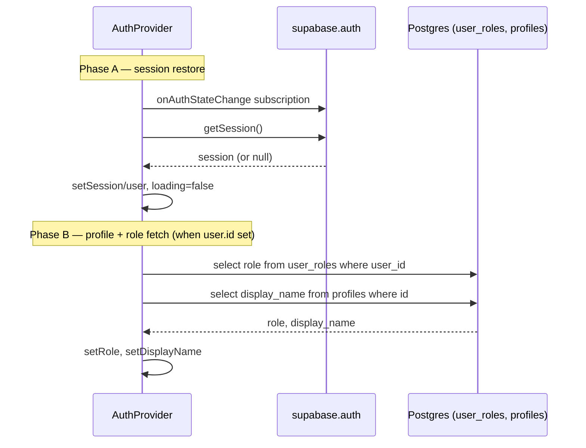

# Authentication and Roles

StudyQuest uses Supabase Auth with a two-role model: `parent` and `student`
(defined as the Postgres enum `app_role`). Roles are not claims in the JWT —
they live in the `user_roles` table and are fetched after authentication. The
role drives both the UI (which tabs and components render) and the RLS policies
on the database.

## Auth context — `useAuth`

`src/hooks/useAuth.tsx` exports an `AuthProvider` and `useAuth()` hook backed by
a React Context. It exposes `{ user, session, role, displayName, loading,
signOut }`.

The provider runs in two phases to avoid races between session restore and
profile/role fetching:



A `fetchIdRef` counter guards against stale fetches: each `user.id` change
increments the ref, and a fetch result is discarded unless its id still matches.
When the session is cleared (sign-out or no session), `role` and `displayName`
are reset to `null`.

`signOut()` calls `supabase.auth.signOut()` and clears all local state. Because
the client is configured with `persistSession: true` and `localStorage` storage,
a signed-in user is restored across reloads.

## Signup and the `handle_new_user` trigger

`src/pages/Auth.tsx` implements login and signup in a tabbed form. Signup calls
`supabase.auth.signUp` with `options.data` carrying the chosen role and display
name:

```ts
supabase.auth.signUp({
  email, password,
  options: {
    emailRedirectTo: window.location.origin,
    data: { display_name: displayName, role: selectedRole },
  },
});
```

These metadata values are consumed by the `handle_new_user()` `SECURITY DEFINER`
<!-- openwiki: broken internal link [../architecture/data-model.md] file "../architecture/data-model.md" does not exist. Fix the href or restore the target, then delete this comment. -->
trigger on `auth.users` (see [data model](../architecture/data-model.md)), which
inserts a matching `profiles` row and a `user_roles` row. The role is therefore
assigned server-side at signup, not client-side, which prevents users from
arbitrarily elevating themselves later (migration `20260416211142` blocks all
authenticated writes to `user_roles`).

The signup form's role picker defaults to `student` and offers only `parent` or
`student`.

## Route guards

`src/App.tsx` defines two guard components built on `useAuth`:

- `ProtectedRoute` — if `loading`, renders a centered loading state; if no
  `user`, redirects to `/auth`; otherwise renders children. Wraps the `Index`
  route at `/`.
- `AuthRoute` — if a `user` is already present (and not loading), redirects to
  `/`; otherwise renders children. Wraps the `Auth` route at `/auth`.

The catch-all `*` route renders `NotFound`.

## Role-based UI gating

`src/pages/Index.tsx` reads `role` from `useAuth` and branches the UI:

- `isParent = role === "parent"` — Dashboard shows
<!-- openwiki: broken internal link [../parent-dashboard.md] file "../parent-dashboard.md" does not exist. Fix the href or restore the target, then delete this comment. -->
  [ParentSummaryDashboard](../parent-dashboard.md) + RecentScores; Classes allows
  schedule management; AI Mentor tab renders the parent view (4 sub-tabs).
- `isStudent = role === "student"` — Dashboard shows StreakWidget, LevelProgress,
  DailyLogForm, RecentScores; AI Mentor tab renders
<!-- openwiki: broken internal link [../ai-mentor.md] file "../ai-mentor.md" does not exist. Fix the href or restore the target, then delete this comment. -->
  [StudentAIMentorChat](../ai-mentor.md); badge notifications surface pending/
  completed AI exams.

Several components also independently read `role` from `useAuth` to decide what
to render or which actions to allow (e.g. `MockExamTracker`, `ClassSchedule`'s
`canManageSchedule`, the AI mentor credit UI).

## Parent-vs-student database access

<!-- openwiki: broken internal link [../architecture/data-model.md] file "../architecture/data-model.md" does not exist. Fix the href or restore the target, then delete this comment. -->
The RLS policies (detailed in [data model](../architecture/data-model.md)) encode
two access patterns:

- **Owner-scoped**: each user reads/edits their own `daily_logs`, `mock_exams`,
  `class_entries` rows.
- **Parent overseer**: a `parent` can read all rows of student-shared tables,
  manage AI exams they created, and manage credit settings. Parents bypass the
<!-- openwiki: broken internal link [../ai-mentor.md] file "../ai-mentor.md" does not exist. Fix the href or restore the target, then delete this comment. -->
  AI mentor daily credit limit entirely (see [AI mentor](../ai-mentor.md)).
- **Student read-across**: students can read all `class_schedules`,
  `class_entries`, and `mock_exams` (so the shared class-diary model works with
  a single student).

## Single-student lookup assumption

StudyQuest assumes **one student per installation**. Parent-facing components
resolve the linked student by querying `user_roles` for the first student:

```ts
supabase.from("user_roles").select("user_id").eq("role", "student").limit(1).single();
```

This pattern appears in both
<!-- openwiki: broken internal link [../ai-mock-exams.md] file "../ai-mock-exams.md" does not exist. Fix the href or restore the target, then delete this comment. -->
[`ParentMockCreator`](../ai-mock-exams.md) and
<!-- openwiki: broken internal link [../parent-dashboard.md] file "../parent-dashboard.md" does not exist. Fix the href or restore the target, then delete this comment. -->
[`ParentCreditSettings`](../parent-dashboard.md). The
`limit(1).single()` call means a second student row would cause a Postgrest
error (`.single()` expects exactly one row). The "Parents can read all roles"
RLS policy exists specifically to authorize this cross-user lookup. This is a
deliberate single-household design, not a multi-tenant one.
